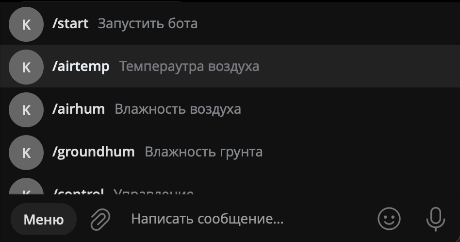

# Описание решения команды


**Все функции в боте реализованы через команды меню**



## Описание возможностей реализованного Telegram-бота

1. Разделение пользователей на обычных и пользователей с повышенными правами (администраторов)
2. Для всех пользователей бота доступны следующие функции:
   
   - **Получение показаний с датчиков температуры и влажности воздуха (последние 10 полученных показаний)** - можно выбрать конкретные датчики, посчситать средние значение. Бот присылает данные в виде списка, а также в виде графиков. [Примеры работы](examples.md)
   - **Получение показаний с датчиков влажности почвы (последние 10 полученных показаний)** - можно выбрать конкретные датчики, посчситать средние значение. Бот присылает данные в виде списка, а также в виде графиков. [Примеры работы](examples.md)

3. Для пользователей с повышенными правами доступны дополнительные функции:

   - **Управление системой увлажнения воздуха в теплице** - можно включить или выключить систему. [Примеры работы](examples.md)
   - **Управление положением окон в теплице** - можно открыть или закрыть окна. [Примеры работы](examples.md)
   - **Задание интервалов нормальных значений** - можно задать границы интервалов нормальных значений для показаний температуры и влажности воздуха, влажности почвы. [Примеры работы](examples.md)
   - **Внесение показаний датчиков вручную** - можно вручную добавить показания датчиков температуры и влажности воздуха или влажности почвы. [Примеры работы](examples.md)
   - **Принудительное управление системой увлажнения и положением окон** - не учитывая пределы нормальных значений показаний датчиков. [Примеры работы](examples.md)
   - **Задание периода опроса датчиков** - можно задать период обращения к API теплицы в секундах с целью получения показаний со всех установленных в ней датчиков для сбора и анализа статистики. [Примеры работы](examples.md)

## Описание команд Telegram-бота

- [```/airtemp```](#airtemp) - Получить показания температуры воздуха в теплице.
- [```/airhum```](#airhum) - Получить показания влажности воздуха в теплице.
- [```/groundhum```](#groundhum) - Получить показания влажности почвы в теплице.
- [```/control```](#control) - Управление системой увлажнения, системами полива грядок, окнами в теплице (с учетом текущих значений с датчиков в теплице).
- [```/force_control```](#forcecontrol) - Принудительное управление системой увлажнения, системами полива грядок, окнами в теплице.
- [```/add_values```](#addvalues) - Добавить новые показания датчиков температуры и влажности воздуха, влажности почвы.
- [```/set_params```](#setparams) - Изменить границы интервалов нормальных значений параметров с джатчиков в теплице.
- [```/help```](#help) - Вывести справку.

Список функций, доступных пользователю, формируется в момент первого обращения пользователя к боту. Код, описывающий процесс добавления команд приведен в файле [set_bot_command](../tg_bot/utils/set_bot_commands.py):

```python
async def set_commands(dp: Dispatcher, chat_id: str):
    await dp.bot.set_my_commands(
        commands=
        [
            types.BotCommand("start", "Запустить бота"),
            types.BotCommand("airtemp", "Температура воздуха"),
            types.BotCommand("airhum", "Влажность воздуха"),
            types.BotCommand("groundhum", "Влажность грунта"),
            types.BotCommand("help", "Вывести справку"),
        ] if chat_id not in ADMINS else
        [
            types.BotCommand("start", "Запустить бота"),
            types.BotCommand("airtemp", "Температура воздуха"),
            types.BotCommand("airhum", "Влажность воздуха"),
            types.BotCommand("groundhum", "Влажность грунта"),
            types.BotCommand("control", "Управление"),
            types.BotCommand("force_control", "Принудительное управление"),
            types.BotCommand('add_values', "Добавить показания датчиков"),
            types.BotCommand('set_params', "Изменить параметры"),
            types.BotCommand("help", "Вывести справку"),
        ],
        scope=BotCommandScopeChat(
            chat_id=chat_id
        )
    )
```

### /airtemp

После выбора данной команды бот предлагает выбрать с каких датчиков пользователь хочет получить информацию. Также бот сразу предлагает выбрать среднее значение со всех датчиков.

```python
temp_sensor_list = set()


@dp.message_handler(CommandAirTemp(), chat_type='private')
async def air_temp_request(message: types.Message):
    await dp.bot.delete_message(chat_id=message.chat.id,
                                message_id=message.message_id)
    global temp_sensor_list
    temp_sensor_list.clear()
    await message.answer(text='Выберите, информацию с каких датчиков температуры Вы хотите получить',
                         reply_markup=get_air_temp_hum_keyboard(param='temp', sensor_list=temp_sensor_list))


@dp.callback_query_handler(choose_sensor_callback_data.filter(param='temp'))
async def add_item_to_temp_plot(call: CallbackQuery, callback_data: dict):
    await call.answer(cache_time=1)
    action = callback_data.get('action').split('_')[0]
    sensor_id = int(callback_data.get('action').split('_')[1])
    global temp_sensor_list
    temp_sensor_list.add(sensor_id) if action == 'add' else temp_sensor_list.remove(sensor_id)
    await dp.bot.edit_message_reply_markup(
        reply_markup=get_air_temp_hum_keyboard(param='temp', sensor_list=temp_sensor_list),
        chat_id=call.message.chat.id,
        message_id=call.message.message_id
    )
```

Более подробно ознакомиться с кодом получения показаний с датчиков температуры воздуха можно в файле [air_temp.py](../tg_bot/handlers/private_chats/commands/air_temp.py).

### /airhum

Аналогичным образом после выбора данной команды бот предлагает выбрать с каких датчиков пользователь хочет получить информацию. Также бот сразу предлагает выбрать среднее значение со всех датчиков.

```python
hum_sensor_list = set()


@dp.message_handler(CommandAirHum(), chat_type='private')
async def air_hum_request(message: types.Message):
    await dp.bot.delete_message(chat_id=message.chat.id,
                                message_id=message.message_id)
    global hum_sensor_list
    hum_sensor_list.clear()
    await message.answer(text='Выберите, информацию с каких датчиков влажности Вы хотите получить',
                         reply_markup=get_air_temp_hum_keyboard(param='hum', sensor_list=hum_sensor_list))


@dp.callback_query_handler(choose_sensor_callback_data.filter(param='hum'))
async def add_item_to_air_hum_list(call: CallbackQuery, callback_data: dict):
    await call.answer(cache_time=1)
    action = callback_data.get('action').split('_')[0]
    sensor_id = int(callback_data.get('action').split('_')[1])
    global hum_sensor_list
    hum_sensor_list.add(sensor_id) if action == 'add' else hum_sensor_list.remove(sensor_id)
    await dp.bot.edit_message_reply_markup(
        reply_markup=get_air_temp_hum_keyboard(param='hum', sensor_list=hum_sensor_list),
        chat_id=call.message.chat.id,
        message_id=call.message.message_id
    )

```

Более подробно ознакомиться с кодом получения показаний с датчиков влажности воздуха можно в файле [air_hum.py](../tg_bot/handlers/private_chats/commands/air_hum.py).

### /groundhum

Аналогичным образом после выбора данной команды бот предлагает выбрать с каких датчиков пользователь хочет получить информацию. Также бот сразу предлагает выбрать среднее значение со всех датчиков.

```python
ground_sensor_list = set()


@dp.message_handler(CommandGroundHum(), chat_type='private')
async def ground_hum_request(message: types.Message):
    await dp.bot.delete_message(chat_id=message.chat.id,
                                message_id=message.message_id)
    global ground_sensor_list
    ground_sensor_list.clear()
    await message.answer(text='Выберите, информацию с каких датчиков влажности почвы Вы хотите получить',
                         reply_markup=get_ground_hum_keyboard(param='ground', sensor_list=ground_sensor_list))


@dp.callback_query_handler(choose_sensor_callback_data.filter(param='ground'))
async def add_item_ground_hum_list(call: CallbackQuery, callback_data: dict):
    await call.answer(cache_time=1)
    action = callback_data.get('action').split('_')[0]
    sensor_id = int(callback_data.get('action').split('_')[1])
    global ground_sensor_list
    ground_sensor_list.add(sensor_id) if action == 'add' else ground_sensor_list.remove(sensor_id)
    await dp.bot.edit_message_reply_markup(
        reply_markup=get_ground_hum_keyboard(param='ground', sensor_list=ground_sensor_list),
        chat_id=call.message.chat.id,
        message_id=call.message.message_id
    )

```

Более подробно ознакомиться с кодом получения показаний с датчиков влажности почвы можно в файле [ground_hum.py](../tg_bot/handlers/private_chats/commands/ground_hum.py).


### /control

Предварительно происходит проверка, что у пользователя есть повышенные права пользователя. Код фильтра ```role_filter``` находится в файле [role_filter.py](../tg_bot/filters/role_filter.py):

```python
class RoleFilter(BoundFilter):
    key = 'role_filter'

    def __init__(self, role_filter: typing.Optional[str] = None):
        self.role_filter = role_filter

    async def check(self, obj):
        if self.role_filter is None:
            return
        if isinstance(obj, Message):
            if self.role_filter == 'admin':
                return str(obj.chat.id) in ADMINS
        if isinstance(obj, CallbackQuery):
            if self.role_filter == 'admin':
                return str(obj.message.chat.id) in ADMINS
        return False
```
И при получении команды с помощью этого фильтра происходит проверка наличия прав и выбор дальнейшего действия:
```python
@dp.message_handler(CommandControl(), chat_type='private', role_filter='admin')
async def control_command_with_admin(message: types.Message):
    await dp.bot.delete_message(chat_id=message.chat.id,
                                message_id=message.message_id)
    await message.answer(text='Выберите, чем хотите управлять',
                         reply_markup=get_control_markup(force_control='off'))


@dp.message_handler(CommandControl(), chat_type='private')
async def control_command_no_admin(message: types.Message):
    await dp.bot.delete_message(chat_id=message.chat.id,
                                message_id=message.message_id)
    await message.answer(text='Команда /control доступна только администраторам')
```
После выбора данной команды бот предлагает выбрать какими системами пользователь хочет управлять. 

### /force_control

Аналогично с предыдущей командой происходит обработка получения команды принудительного управления:

```python
@dp.message_handler(CommandForceControl(), chat_type='private', role_filter='admin')
async def control_command_with_admin(message: types.Message):
    await dp.bot.delete_message(chat_id=message.chat.id,
                                message_id=message.message_id)
    await message.answer(text='Выберите, чем хотите управлять',
                         reply_markup=get_control_markup(force_control='on'))


@dp.message_handler(CommandForceControl(), chat_type='private')
async def control_command_no_admin(message: types.Message):
    await dp.bot.delete_message(chat_id=message.chat.id,
                                message_id=message.message_id)
    await message.answer(text='Команда /force_control доступна только администраторам')
```

### /add_values

### /set_params

### /help